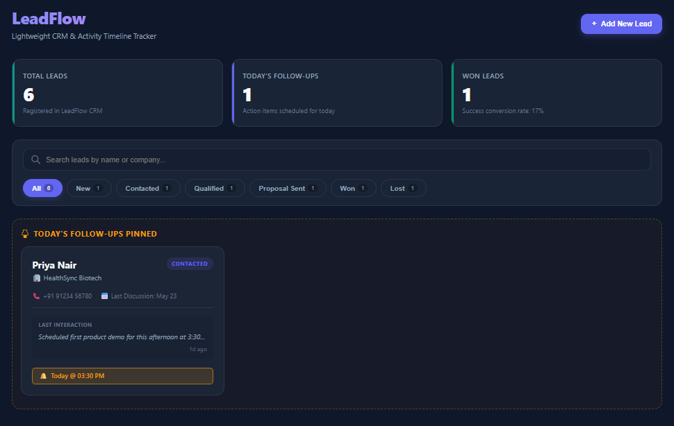
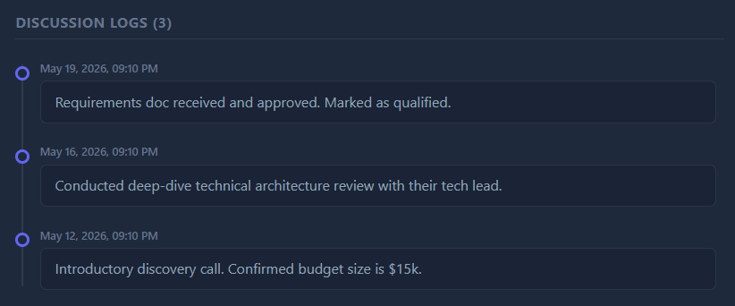
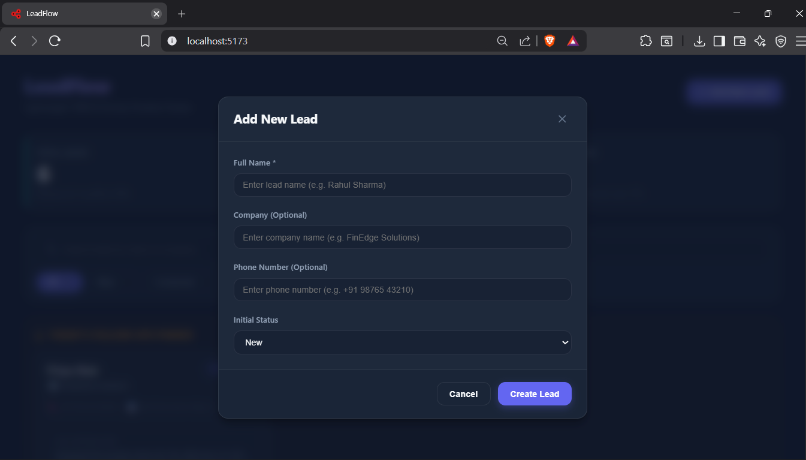
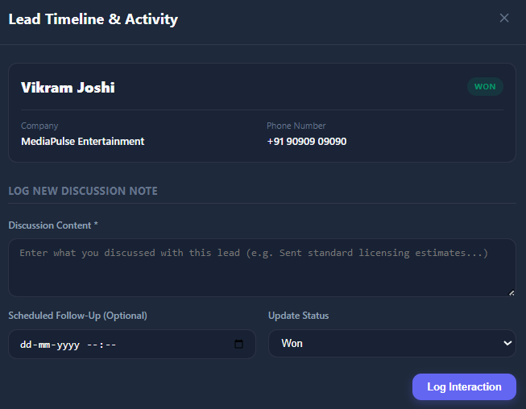
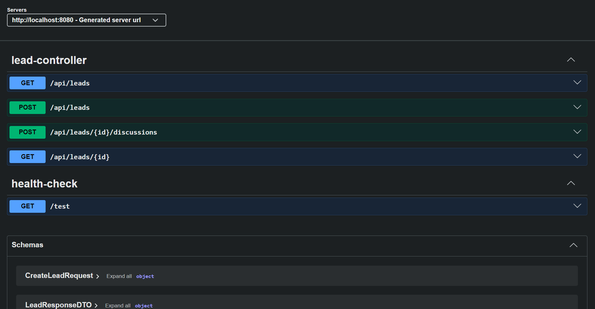

# LeadFlow CRM

**LeadFlow** is a modern, high-fidelity, single-screen Lead Management system and lightweight CRM. It allows sales representatives to register customer leads, track active pipelines, log interaction logs on a chronological timeline, schedule follow-ups, and get instant warning tags when calendar milestones are overdue.

This project was built using **Spring Boot (Java 21)** and **React (Vite)**.

---

## Architecture & Features

### Tech Stack
* **Backend**: Spring Boot 4.0.6, Java 21, Spring Data JPA, Lombok, Dotenv, SpringDoc OpenAPI (Swagger).
* **Database**: PostgreSQL (seeding enabled on startup).
* **Frontend**: React 19, Vite 8, Axios, Vanilla CSS (premium dark-mode variables, glassmorphic layout, dynamic tickers).
* **Containers**: Docker Compose for hosting local Postgres.

### CRM Feature Highlights
1. **Dynamic Performance Indicators**: Header counters showing total leads, live count of follow-ups scheduled for today, and conversion ratios.
2. **Search & Pipeline Filters**: Instantly query leads by name/company or filter the dashboard by status using dynamic badge count pills.
3. **Today's Follow-up Pins**: Leads with active follow-ups mapped to today's local date are automatically isolated and pinned at the very top of the list in a dedicated "Today's Queue" banner.
4. **Reactive Timelines**: Dialog modal showing chronological historical logs. Adding an interaction note, scheduling follow-ups, and updating the lead's status is executed as an atomic server transaction and reflects on the UI instantly without page refreshing!
5. **Overdue Warnings**: Visual indicators that highlight active leads whose follow-up milestones are in the past.

---

## Screenshots

### Dashboard View


### Timeline Modal


### Add New Lead


### Log New Discussion


### Swagger API Documentation


---

## Getting Started

### Prerequisites
* **Java**: JDK 21
* **Node.js**: Node 18+ (npm)
* **Docker**: Optional (for running Postgres easily)

---

### 1. Clone the Repository

```bash
git clone https://github.com/Srivardhan00/LeadFlow.git
cd LeadFlow
```

---

### 2. Database Setup

Choose **one** of the two methods below to host your PostgreSQL database:

#### Method A: Using Docker Compose (Recommended - Zero Setup)
Make sure Docker Desktop is running, and execute this command in the project root:
```bash
docker compose up -d
```
This spins up a container running PostgreSQL on port `5432` with username `postgres`, password `12345678`, and database `leadflow`.

#### Method B: Local PostgreSQL Installation
If you prefer running a local database instance:
1. Ensure Postgres is running on port `5432`.
2. Create a database named `leadflow`.
3. Verify that your username and password match the backend configuration in `backend/.env`.

---

### 3. Backend Setup (Spring Boot)

1. Open a terminal and navigate to the `backend` folder:
   ```bash
   cd backend
   ```

2. **Configure environment variables**:
   - Copy the example environment file to create your own local `.env`:
     ```bash
     # On Windows (PowerShell)
     Copy-Item .env.example .env

     # On Linux/macOS
     cp .env.example .env
     ```
   - Open `backend/.env` and fill in your database credentials:
     ```env
     DATABASE_URL=jdbc:postgresql://localhost:5432/leadflow
     DATABASE_USERNAME=postgres
     DATABASE_PASSWORD=12345678
     ```
   - These environment variables are loaded at application startup by `dotenv-java` and injected into `application.properties` via `${DATABASE_URL}`, `${DATABASE_USERNAME}`, and `${DATABASE_PASSWORD}` placeholders.

3. Run the Spring Boot application using the Maven wrapper:
   ```bash
   # On Windows (PowerShell)
   .\mvnw spring-boot:run
   
   # On Linux/macOS
   ./mvnw spring-boot:run
   ```

4. On startup, Spring Data JPA will automatically drop and recreate tables, and execute `src/main/resources/data.sql` to seed the database with **6 leads** and **15+ chronological historical interactions**!

5. **API Documentation (Swagger UI)**: Once the backend is running, you can explore and test **all** API endpoints interactively using Swagger UI:

   **[http://localhost:8080/swagger-ui/index.html](http://localhost:8080/swagger-ui/index.html)**

   Swagger provides auto-generated documentation for every endpoint, including request/response schemas, so you can test the API directly from your browser without needing Postman or cURL.

---

### 4. Frontend Setup (React + Vite)

1. Open a **second terminal** and navigate to the `frontend` folder:
   ```bash
   cd frontend
   ```
2. Install dependencies (first time only):
   ```bash
   npm install
   ```
3. Launch the Vite development server:
   ```bash
   npm run dev
   ```
4. Open your browser and navigate to the application:

   **[http://localhost:5173/](http://localhost:5173/)**

---

## 🔌 API Reference Summary

The backend exposes a RESTful API under the `/api/leads` mapping. For full interactive documentation with request/response schemas, visit the **[Swagger UI](http://localhost:8080/swagger-ui/index.html)** after starting the backend.

| Method | Endpoint | Request Body | Description |
| :--- | :--- | :--- | :--- |
| **GET** | `/api/leads` | *None* | Get all leads with pre-computed last interaction details |
| **GET** | `/api/leads/{id}` | *None* | Get a single lead's full timeline history in reverse chronological order |
| **POST** | `/api/leads` | `CreateLeadRequest` | Register a new lead (defaults to NEW) |
| **POST** | `/api/leads/{id}/discussions` | `AddDiscussionRequest` | Log a discussion, change lead status, and schedule follow-ups |

> **For detailed request/response schemas, try the endpoints live at [Swagger UI](http://localhost:8080/swagger-ui/index.html).**
